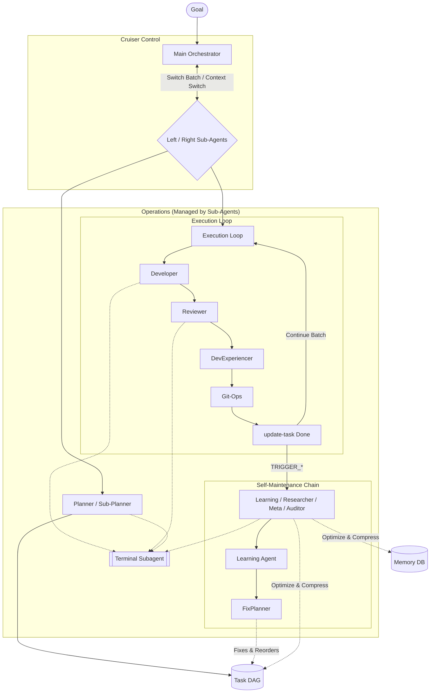

# DreamTeam — Autonomous Development Cruiser for Cursor

A long-range **Autonomous Development Cruiser for Cursor** capable of executing **500–1000+ sequential tasks** without quality degradation. Built for fault tolerance, continuous learning, and multi-layered agent orchestration.

> [!IMPORTANT]
> **Orchestration Zero:** DreamTeam is designed to offload work from the main chat. It dispatches **Left and Right Sub-Orchestrators** to run batches of 15+ tasks with minimal supervision.

**Quick Start:**
1. `python -m dreamteam new-project .` (in an empty folder)
2. Open in Cursor → `/start` + your goal
3. Start or resume the execution loop: `/run`

---

## Pipeline: High-Performance Autonomy

The system uses a recursive orchestration loop. The **Main Orchestrator** dispatches specialized sub-orchestrators to handle batches of tasks, keeping the main context clean and stable.

---

## Under the Hood: Scalable Autonomy

The system is built to minimize "Main Chat" context overflow. Using a **Dual Sub-Orchestrator system (Left/Right)**, DreamTeam offloads execution to sub-agents, leaving the main chat lean and responsive. This architectural split allows massive task sequences to run even on non-frontier models.
## AI Sub-Agent Hierarchy

DreamTeam uses a multi-layered intelligence system to ensure stability over long durations:

1.  **Level 1: Cruiser Control (Main Orchestrator)**: The entry point. It doesn't perform tasks but manages the switching between "Left" and "Right" sub-orchestrators. This ensures that even for 1000-task journeys, the main chat context remains lean and responsive.
2.  **Level 2: Mission Dispatch (Sub-Orchestrators)**: Specialized dispatchers that run inside a fresh context. They decide whether to launch the **Planning Phase** or the **Execution Loop** and handle all self-correction triggers.
3.  **Level 3: Specialized Workers**: 
    *   **Planner & Sub-Planner**: Decompose high-level goals into a detailed task DAG.
    *   **Developer**: Implements features and runs tests.
    *   **Reviewer**: Verifies code quality and architectural compliance.
    *   **Git-Ops**: Handles commits and repository maintenance.
    *   **Maintenance Agents**: (Researcher, Learning, Meta-Planner, Auditor) Keep the context compressed and the pipeline optimized.

---

## Core Mechanisms

### Fault Tolerance — Nothing Gets Lost
The system is designed to recover from crashes, mismatches, and stuck tasks without manual intervention:
*   **run-next**: Verifies DB↔Files consistency, auto-syncs if needed, and resets stuck tasks.
*   **recover**: Full system reset, integrity verification, and memory health check.
*   **State-in-DB**: All state lives in SQLite. The Cruiser can resume after a break without losing a single bit of context.

### Learnability — The Pipeline Adapts
DreamTeam improves from production feedback instead of degrading:
*   **DevExperiencer**: Records every outcome, attempt count, and time spent.
*   **Learning Agent**: Analyzes the Experience DB to detect patterns of failure or high friction.
*   **FixPlanner**: Automatically adjusts upcoming tasks (library choices, dependency updates) to avoid recurring roadblocks.
*   **Developer Updates**: The system may augment `.cursor/agents/developer-addendum.md` with additional instructions to permanently adopt successful patterns.

### Analytics Dashboard — Monitor the Friction
Launch a minimalistic web dashboard to track your Cruiser's performance:
*   **KPIs**: Total tasks, estimated tokens, and **Friction Score** (Avg Attempts).
*   **Visualization**: Identify hallucination spikes and time-heavy tasks.
*   **Task Lineage**: Track original plans vs. tasks added during self-correction.

> **Command:** `python -m dreamteam dashboard`

---

## Documentation
- [guide/](guide/) — Full setup, commands, and best practices.
- [INSTRUCTIONS.md](guide/INSTRUCTIONS.md) — System overview.
- [COMMANDS.md](guide/COMMANDS.md) — CLI reference.

---

## License
PolyForm Noncommercial 1.0.0 — personal, educational, and non-profit use only. See [LICENSE](LICENSE).

---

Crafted for Cursor adepts with love from <b>BuLab</b>

