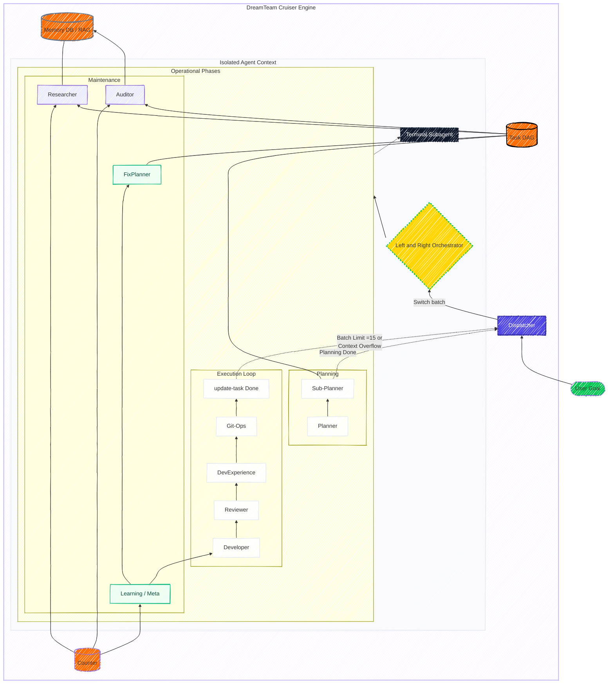

# DreamTeam — Autonomous Development Cruiser for Cursor

A long-range **Autonomous Development Cruiser for Cursor** capable of executing **500+ sequential tasks** without quality degradation. Built for fault tolerance, continuous learning, and multi-layered agent orchestration using **ping-pong execution loop**.

> [!IMPORTANT]
> **Dispatcher Architecture:** DreamTeam is designed to offload deep work from the main chat. The **Dispatcher** coordinates **Left and Right Orchestrators** to run batches of 15+ tasks with minimal supervision. Each context switch (ping-pong) performs a context reset, ensuring the dispatcher never hits context ceilings. This is the key to executing **500+ tasks** with zero performance degradation.

**Quick Start:**
1. `python -m dreamteam new-project .` (in an empty folder)
2. Open in Cursor → `/start` + your goal
3. Start or resume the execution loop: `/run`

---

## Pipeline: High-Performance Autonomy

The system uses a recursive dispatching loop. The **Dispatcher** coordinates specialized orchestrators to handle batches of tasks, keeping the main context clean and stable.

---

## Under the Hood: Scalable Autonomy

The system is built to minimize "Main Chat" context overflow. Using a **Dual Orchestrator system (Left/Right)**, DreamTeam offloads execution to sub-agents, leaving the main chat lean and responsive. This architectural split allows massive task sequences to run even on non-frontier models.
## AI Sub-Agent Hierarchy

DreamTeam uses a multi-layered intelligence system to ensure stability over long durations:

1.  **Level 1: Fleet Control (Dispatcher)**: The entry point. It doesn't perform tasks but manages the switching between "Left" and "Right" Orchestrators. This ensures that even for 1000-task journeys, the main chat context remains lean and responsive.
2.  **Level 2: Task Orchestration (Orchestrators)**: Specialized agents that run inside a fresh context. They decide whether to launch the **Planning Phase** or the **Execution Loop** and handle all self-correction triggers.
3.  **Level 3: Specialized Workers**: 
    *   **Planner & Sub-Planner**: Decompose high-level goals into a detailed task DAG.
    *   **Developer**: Implements features and runs tests.
    *   **Reviewer**: Verifies code quality and architectural compliance.
    *   **Git-Ops**: Handles commits and repository maintenance.
    *   **Maintenance Agents**: (Researcher, Learning, Meta-Planner, Auditor) Keep the context compressed and the pipeline optimized.

---

## Economy & Model Selection

> [!IMPORTANT]
> **Model Inheritance:** By default, all sub-agents inherit the model name chosen in the main chat (where `/start` or `/run` was invoked).

To optimize project **economy**:
*   **Heavy Reasoning** (Planner, Auditor, Researcher, Learning): We recommend using frontier models (e.g., Claude 4.6 Sonnet) for high architectural compliance.
*   **Routine Tasks** (Developer, Reviewer, Git-Ops): These can often be shifted to more economical models to maintain sustainability over 500+ sequential tasks.

Thoughtful model selection ensures the Project Budget lasts for the entire Cruiser journey.

---

## Core Mechanisms

### Fault Tolerance — Nothing Gets Lost
The system is designed to recover from crashes, mismatches, and stuck tasks without manual intervention:
*   **run-next**: Verifies DB↔Files consistency, auto-syncs if needed, and resets stuck tasks.
*   **recover**: Full system reset, integrity verification, and memory health check.
*   **State-in-DB**: All state lives in SQLite. The Cruiser can resume after a break without losing a single bit of context.

### Learnability — The Pipeline Adapts
DreamTeam improves from production feedback instead of degrading:
*   **DevExperiencer**: Records every outcome, attempt count, and time spent.
*   **Learning Agent**: Analyzes the Experience DB to detect patterns of failure or high friction.
*   **FixPlanner**: Automatically adjusts upcoming tasks (library choices, dependency updates) to avoid recurring roadblocks.
*   **Developer Updates**: The system may augment `.cursor/agents/developer-addendum.md` with additional instructions to permanently adopt successful patterns.

### Analytics Dashboard — Monitor the Friction
Launch a minimalistic web dashboard to track your Cruiser's performance:
*   **KPIs**: Total tasks, estimated tokens, and **Friction Score** (Avg Attempts).
*   **Visualization**: Identify hallucination spikes and time-heavy tasks.
*   **Task Lineage**: Track original plans vs. tasks added during self-correction.

> **Command:** `python -m dreamteam dashboard`

---

## Documentation
- [guide/](guide/) — Full setup, commands, and best practices.
- [INSTRUCTIONS.md](guide/INSTRUCTIONS.md) — System overview.
- [COMMANDS.md](guide/COMMANDS.md) — CLI reference.

---

## License

**PolyForm Noncommercial 1.0.0** — for personal, educational, and non-profit use only.  
See [LICENSE](LICENSE) for full details.

### Author’s Engineering Pattern Notice

The dual-orchestrator dispatch model (also referred to as the “ping-pong execution loop” with context resets) is an original engineering approach developed as part of the DreamTeam system.
Unlike conventional multi-agent orchestration, where coordination occurs within a single persistent context, this pattern is based on externalized dispatching between two alternating orchestrators, each operating within an isolated execution context and explicitly reset after completing a bounded sequence of tasks (N-step execution cycle).
This approach enables controlled long-running LLM pipelines by:
- preventing unbounded context accumulation;
- enforcing deterministic execution segments;
- isolating intermediate state across cycles.

The specific combination of alternating orchestrators, dispatcher-mediated control flow, bounded task cycles, and systematic context resets constitutes a proprietary system design developed by the authors.
Commercial use, reproduction, or adaptation of this architecture — including functionally equivalent systems that replicate its core execution principles — is prohibited without a separate commercial license.
This restriction does not apply to personal, educational, or non-profit use, which is permitted under the PolyForm Noncommercial 1.0.0 license.
This notice applies to the dispatching model, execution cycle structure, and context management methodology as embodied in this project and its associated materials.

---

Crafted for Cursor adepts with love from <b>BuLab</b>

